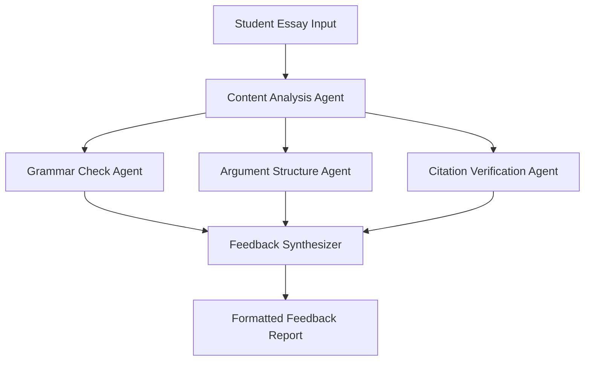

# Create Local Run LLMs: A Comprehensive Workshop

## Open Educational Resources (OER) and Local AI - Introduction

> **🤖 What is AI?**
> 
> **Current Reality:**
> 
> - No universally accepted definition exists
> - We're primarily discussing **probability machines**
> - AI learns from past data and presents historical patterns
> 
> **Human Factor:**
> 
> - We attribute understanding or consciousness to generated text where none exists
> - Critical consideration: What processes do we actually want to automate?

### 🔓 Open Source AI Systems

The integration of AI with Open Educational Resources represents a paradigm shift in educational technology. Building on the foundational principles established in the Dubai Declaration and UNESCO's 2019 OER Recommendation, we now face new challenges around AI training data usage rights and the need for transparent, locally-controlled AI systems.

**Four Essential Freedoms for Open Source AI:**

1. **Use** - Deploy for any purpose
2. **Study** - Examine how it works
3. **Modify** - Adapt to your needs
4. **Share** - Distribute improvements

**Technical Requirements:**

- 🏋️ **Open Weights** - Model weights and parameters
- 💻 **Open Code** - Training source code and dataset creation code
- 📊 **Open Data** - Complete training data list (when legally permitted)

## Workshop Overview: Local LLM Implementation

### 🎯 Learning Objectives

By the end of this workshop, participants will be able to:

- Understand the advantages of running LLMs locally in educational settings
- Install and configure GPT4All for GUI-based LLM implementation
- Create effective prompts for educational applications
- Implement basic AI workflows using local models
- Evaluate different local AI solutions for specific educational needs

## Part 1: Understanding Local LLMs in Education

### Why Run LLMs Locally?

**🔒 Privacy and Data Security**
- Student data remains on institutional servers
- Compliance with educational data protection laws (FERPA, GDPR)
- No risk of proprietary educational content being shared externally

**💰 Cost Effectiveness**
- Eliminate recurring API subscription costs
- Reduce bandwidth requirements
- Scalable without per-usage fees

**🎛️ Control and Customization**
- Fine-tune models for specific educational domains
- Customize responses to align with institutional values
- Maintain consistent availability during peak usage

**⚡ Performance Benefits**
- Faster response times without network latency
- Offline functionality for remote or low-connectivity environments
- Reduced dependency on external service availability

### Educational Applications

**Content Creation**
- Generate lesson plans and learning activities
- Create practice questions and assessments
- Develop multilingual educational materials

**Student Support**
- Personalized tutoring assistance
- Writing feedback and improvement suggestions
- Subject-specific help without privacy concerns

**Administrative Tasks**
- Automated grading rubric creation
- Parent communication templates
- Curriculum alignment checking

## Part 2: GPT4All Implementation Guide

### What is GPT4All?

**GPT4All** is an open-source tool developed by Nomic AI that enables users to run Large Language Models locally on personal computers. It provides a user-friendly graphical interface similar to ChatGPT while maintaining complete privacy and control.

### Installation Process

#### Step 1: Download and Install

1. Visit the [GPT4All official website](https://gpt4all.io) or [GitHub repository](https://github.com/nomic-ai/gpt4all)
2. Download the appropriate installer for your operating system:
   - **Windows**: GPT4All Windows Installer
   - **macOS**: GPT4All macOS Installer (requires Monterey 12.6 or newer)
   - **Linux**: GPT4All Ubuntu Installer (x86-64 only)
3. Run the installer and follow the setup instructions

#### Step 2: Initial Configuration

1. Launch the GPT4All application
2. Click "Start Chatting"
3. Select "+ Add Model" to browse available models
4. **Recommended starter model**: Llama 3 (balanced performance and resource usage)

#### Step 3: Model Selection

Popular models for educational use:

| Model | Size | Best For | Resource Requirements |
|-------|------|----------|----------------------|
| **Llama 3.2 3B** | 2.0GB | General education, fast responses | Low-mid range computers |
| **Llama 3.2 7B** | 4.7GB | Advanced reasoning, detailed explanations | Mid-range computers |
| **Mistral 7B** | 4.1GB | Multilingual support, structured outputs | Mid-range computers |
| **Phi 4 Mini** | 2.5GB | Compact model, quick tasks | Lower-end computers |

### LocalDocs: Creating Educational Knowledge Bases

One of GPT4All's unique features is **LocalDocs** - the ability to create custom knowledge bases from your educational materials.

#### Setting Up LocalDocs

1. Navigate to the LocalDocs section in GPT4All
2. Create a new collection for your educational content
3. Add relevant documents:
   - Course syllabi
   - Textbooks (PDF format)
   - Lecture notes
   - Educational resources

#### Benefits for Education

- **Curriculum Alignment**: AI responses grounded in your specific curriculum
- **Institutional Knowledge**: Incorporate school policies and procedures
- **Subject Expertise**: Create domain-specific knowledge bases
- **Privacy Maintained**: All content remains local

## Part 3: Effective Prompting for Educational Applications

### Google's 5-Step Prompting Framework

Based on the attached content creation materials, here's how to apply effective prompting in educational contexts:

#### 1. **Task** - What the AI should do

```markdown
Create a quiz about photosynthesis for 8th-grade biology students.
```

**Enhanced with Persona:**
```markdown
You are an experienced middle school science teacher with 10 years of experience.
Create a quiz about photosynthesis for 8th-grade biology students.
```

#### 2. **Context** - Background information

```markdown
You are an experienced middle school science teacher with 10 years of experience.
Create a quiz about photosynthesis for 8th-grade biology students.

Context:
- Students have completed a 2-week unit on plant biology
- Class includes students with varying English proficiency levels
- Assessment should take approximately 15 minutes to complete
- Focus on understanding processes, not memorization
```

#### 3. **References** - External materials or examples

```markdown
You are an experienced middle school science teacher with 10 years of experience.
Create a quiz about photosynthesis for 8th-grade biology students.

Context:
- Students have completed a 2-week unit on plant biology
- Class includes students with varying English proficiency levels
- Assessment should take approximately 15 minutes to complete
- Focus on understanding processes, not memorization

Reference Materials:
Use the following key concepts from our textbook:
- Light-dependent and light-independent reactions
- Chloroplasts and chlorophyll function
- Carbon dioxide + Water + Light Energy → Glucose + Oxygen
- Importance of photosynthesis in ecosystems
```

#### 4. **Evaluate** - Criteria for assessment

```markdown
Format Requirements:
- Include 5 multiple-choice questions
- Add 2 short-answer questions requiring explanations
- Provide clear answer key with explanations
- Use vocabulary appropriate for 8th-grade reading level
- Include at least one diagram-based question
```

#### 5. **Iterate** - Refinement process

After receiving the initial output, refine with follow-up prompts:
- "Make question 3 more challenging by adding a real-world application"
- "Simplify the vocabulary in question 5 for English language learners"
- "Add a visual element to question 2"

### Practical Prompting Examples

#### Example 1: Lesson Plan Generation

```markdown
You are a curriculum designer specializing in elementary education.

Task: Create a 45-minute lesson plan introducing fractions to 3rd-grade students.

Context:
- Students have basic understanding of whole numbers
- Class size: 24 students with mixed learning styles
- Available materials: manipulatives, whiteboard, tablets
- Learning objective: Students will understand fractions as parts of a whole

Format:
- Include warm-up activity (5 minutes)
- Main instruction with examples (20 minutes)
- Hands-on practice activity (15 minutes)
- Closing assessment (5 minutes)
- List required materials
- Provide differentiation strategies

Evaluation Criteria:
- Activities engage visual, auditory, and kinesthetic learners
- Content is age-appropriate and scaffolded
- Assessment aligns with learning objective
- Instructions are clear and actionable
```

#### Example 2: Writing Feedback Assistant

```markdown
You are a writing tutor specializing in academic writing for high school students.

Task: Provide constructive feedback on this student essay about climate change.

Context:
- Student is in 10th grade English class
- Assignment: 5-paragraph argumentative essay
- Focus areas: thesis clarity, evidence usage, organization
- Student struggles with transitions and conclusion strength

[Insert student essay here]

Feedback Format:
- Start with 2 positive observations
- Identify 3 specific areas for improvement
- Provide concrete revision suggestions
- End with encouragement and next steps

Evaluation:
- Feedback should be supportive and growth-oriented
- Suggestions must be actionable and specific
- Language appropriate for 10th-grade level
- Focus on content and organization over grammar
```

## Part 4: Alternative Local LLM Solutions

### Ollama: Command-Line Interface

**Ollama** is a lightweight framework for running LLMs locally via command line. It's ideal for more technical users and integration into educational workflows.

#### Installation

**macOS/Linux:**
```bash
curl -fsSL https://ollama.com/install.sh | sh
```

**Usage Examples:**
```bash
# Install a model
ollama run llama3.2

# List installed models
ollama list

# Start Ollama service
ollama serve
```

#### Benefits for Technical Education

- **Programming Courses**: Integrate into coding assignments
- **API Integration**: Build custom educational applications
- **Batch Processing**: Handle multiple student submissions
- **Workflow Automation**: Combine with other educational tools

### LM Studio: Professional Interface

**LM Studio** provides a professional desktop interface for running local LLMs with advanced configuration options.

**Key Features:**
- Model performance optimization
- Custom API endpoints
- Advanced prompt templates
- Resource usage monitoring

## Part 5: AI Workflows and Agent Implementation

### Understanding AI Workflows

AI workflows combine multiple AI models and tools to accomplish complex educational tasks. Based on the content creation materials, here are practical implementations:

#### Workflow Example: Automated Content Creation Pipeline

**Agent 1: Content Generator**
- Input: Topic and learning objectives
- Output: Raw educational content

**Agent 2: Curriculum Aligner**
- Input: Raw content + curriculum standards
- Output: Aligned and structured content

**Agent 3: Accessibility Checker**
- Input: Structured content + accessibility requirements
- Output: Inclusive, accessible educational material

### Implementation with n8n

**n8n** is an open-source workflow automation tool that can orchestrate AI agents:

1. **Setup n8n locally**
2. **Connect to local LLM via API**
3. **Create workflow nodes**:
   - Input processing
   - LLM interaction
   - Output formatting
   - Quality checking

### Practical Workflow: Student Essay Evaluation



## Part 6: Future Scenarios and Advanced Applications

### AI-Enhanced Learning Environments

**Scenario 1: Personalized Learning Assistants**
- Each student has a local AI tutor trained on their learning patterns
- Real-time adaptation to student progress and preferences
- Privacy-preserving personalization without data sharing

**Scenario 2: Multilingual Education Support**
- Local translation and cultural adaptation of educational content
- Support for indigenous languages and local dialects
- Culturally sensitive educational material generation

**Scenario 3: Collaborative Research Assistance**
- AI agents help students with research methodology
- Automated literature review and citation management
- Hypothesis generation and experimental design support

### Advanced Agent Architectures

#### Multi-Agent Educational Systems

**Teaching Agent Network:**
- **Subject Matter Expert Agents**: Specialized in different disciplines
- **Pedagogical Agent**: Focuses on teaching methodology
- **Assessment Agent**: Handles evaluation and feedback
- **Adaptive Agent**: Adjusts based on student performance

#### Implementation Considerations

**Technical Infrastructure:**
- Local server requirements for multiple agents
- Data synchronization between agents
- Resource allocation and load balancing

**Educational Considerations:**
- Alignment with learning objectives
- Assessment validity and reliability
- Student engagement and motivation

### Emerging Technologies Integration

**Integration with Extended Reality (XR):**
- AI-powered virtual tutors in VR environments
- Augmented reality overlays with contextual AI assistance
- Immersive simulations with intelligent NPCs

**Internet of Things (IoT) in Education:**
- Smart classroom environments with AI coordination
- Automated attendance and engagement tracking
- Environmental optimization for learning

## Part 7: Implementation Guidelines and Best Practices

### Technical Requirements

**Minimum System Requirements:**
- **CPU**: Intel Core i3 2nd Gen / AMD Bulldozer or better
- **RAM**: 8GB minimum, 16GB recommended
- **Storage**: 50GB free space for models and data
- **GPU**: Optional but recommended for faster processing

**Recommended Setup:**
- **CPU**: Modern multi-core processor
- **RAM**: 32GB for handling multiple models
- **Storage**: SSD for faster model loading
- **GPU**: NVIDIA/AMD with 8GB+ VRAM

### Security and Privacy Considerations

**Data Protection:**
- Implement encryption for stored educational data
- Regular backup procedures for local AI systems
- Access control and user authentication

**Model Security:**
- Regular updates to local models when available
- Monitoring for potential security vulnerabilities
- Sandboxing AI applications from critical systems

### Evaluation and Assessment

**Quality Metrics:**
- Response accuracy for educational content
- Alignment with curriculum standards
- Student engagement and learning outcomes
- Teacher satisfaction and workflow efficiency

**Continuous Improvement:**
- Regular model performance evaluation
- Feedback collection from educators and students
- Iterative refinement of prompts and workflows

## Conclusion and Next Steps

### Key Takeaways

1. **Local LLMs provide educational institutions with privacy, control, and cost-effectiveness**
2. **GPT4All offers an accessible entry point for GUI-based implementation**
3. **Effective prompting is crucial for educational applications**
4. **AI workflows can automate complex educational tasks while maintaining quality**
5. **Future developments will enable even more sophisticated educational AI systems**

### Immediate Action Items

**For Educators:**
1. Install and experiment with GPT4All
2. Create a collection of educational prompts for your subject area
3. Develop a LocalDocs knowledge base with course materials
4. Test AI-generated content for accuracy and alignment

**For Institutions:**
1. Assess technical infrastructure requirements
2. Develop policies for local AI usage
3. Plan teacher training and professional development
4. Consider pilot programs in specific departments

### Future Learning Opportunities

**Advanced Topics to Explore:**
- Custom model fine-tuning for educational domains
- Integration with Learning Management Systems (LMS)
- Development of subject-specific AI agents
- Assessment and evaluation of AI-generated educational content

### Resources and References

**Official Documentation:**
- [GPT4All Documentation](https://docs.gpt4all.io/)
- [Ollama Documentation](https://ollama.ai/docs)
- [n8n Workflow Documentation](https://docs.n8n.io/)

**Educational AI Communities:**
- AI for Education forums and discussion groups
- Open source educational AI projects
- Academic research on AI in education

**Continued Learning:**
- UNESCO AI Competency Framework for Teachers
- Open Educational Resources licensing and implementation
- Privacy and security best practices for educational AI

---

*This workshop material is released under Creative Commons Attribution-ShareAlike 4.0 International License. You are free to use, adapt, and share these materials with proper attribution.*